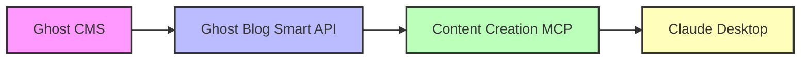

# 🚀 Content Creation MCP Server - AI-Powered Ghost CMS Management

**🎨 Create, manage, and enhance blog posts with AI** through Claude Desktop using the [Model Context Protocol (MCP)](https://modelcontextprotocol.io/)  
**🤖 AI Features**: Google Gemini content generation, Flux & Imagen image creation  
**🔐 Security**: GitHub OAuth authentication with single-user access control  
**☁️ Architecture**: Cloudflare Workers + Ghost Blog Smart API

Transform your content creation workflow with AI-powered tools that let you write blog posts from simple ideas, generate stunning feature images, and manage your Ghost CMS blog - all from Claude Desktop!

## 🏗️ System Architecture

This is a **two-component system** that requires both parts to function:

```
Claude Desktop → Content Creation MCP → Ghost Blog Smart API → Ghost CMS
                 (This Repository)      (Required Backend API)
```

### 📦 Required Components

1. **Ghost Blog Smart API** (Backend - Must Deploy First)
   - GitHub: [https://github.com/preangelleo/ghost-blog-smart](https://github.com/preangelleo/ghost-blog-smart)
   - Provides REST API for Ghost CMS management
   - Handles AI content generation (Google Gemini)
   - Manages image generation (Replicate Flux & Google Imagen)
   - Required for all MCP server functionality

2. **Content Creation MCP Server** (This Repository)
   - Provides MCP protocol interface for Claude Desktop
   - Handles GitHub OAuth authentication
   - Maps MCP tools to Ghost Blog Smart API endpoints
   - Manages secure user sessions

## ✨ Features

### 🤖 AI-Powered Content Creation
- **Smart Create**: Transform rough ideas into complete blog posts with AI
- **Auto Enhancement**: Generate titles, excerpts, and tags automatically
- **Multi-language Support**: Create content in any language
- **Test Mode**: Safely experiment without creating real posts

### 🎨 Dual AI Image Generation
- **Replicate Flux**: Ultra-fast generation (3-7 seconds)
- **Google Imagen**: Professional quality (10-15 seconds)
- **Multiple Aspect Ratios**: 16:9, 1:1, 9:16, 4:3, 3:2
- **Automatic Fallback**: Intelligent provider switching for reliability

### 📝 Complete Blog Management
- **Full CRUD Operations**: Create, read, update, delete posts
- **Advanced Search**: Text search, tag filtering, date patterns
- **Batch Operations**: Process multiple posts efficiently
- **Analytics**: Summary statistics and activity tracking
- **Featured Posts**: Manage featured content easily

### 🔒 Enterprise Security
- **GitHub OAuth**: Secure authentication flow
- **Single-User Access**: Restrict to your GitHub username
- **API Key Protection**: Environment-based configuration
- **Signed Cookies**: HMAC-secured session management

## 🛠️ Available MCP Tools (13 Total)

1. **`ghost_health_check`** - Check API status and version
2. **`ghost_api_info`** - Get API information and endpoints
3. **`ghost_create_post`** - Create new blog post with optional AI image
4. **`ghost_smart_create`** - AI-enhanced post creation from ideas
5. **`ghost_get_posts`** - List posts with filters
6. **`ghost_advanced_search`** - Search with text and tags
7. **`ghost_get_post_details`** - Get complete post information
8. **`ghost_update_post`** - Update post content or metadata
9. **`ghost_update_post_image`** - Generate and update feature image
10. **`ghost_delete_post`** - Permanently delete a post
11. **`ghost_posts_summary`** - Get statistics and analytics
12. **`ghost_batch_get_details`** - Get multiple posts efficiently
13. **`ghost_search_by_date`** - Find posts by date patterns

## 📋 Prerequisites

### Required Services

1. **Ghost CMS Instance**
   - Your Ghost blog with Admin API access
   - Admin API key and URL

2. **Ghost Blog Smart API** ⚠️ **MUST DEPLOY FIRST**
   - GitHub: [https://github.com/preangelleo/ghost-blog-smart](https://github.com/preangelleo/ghost-blog-smart)
   - Deployment options:
     - 🐳 **Docker** (Recommended): `docker run -p 5000:5000 betashow/ghost-blog-smart-api`
     - 🐍 **Python Package**: `pip install ghost-blog-smart`
     - 🌐 **Local Development**: Clone and run with Flask
   - Required environment variables for Ghost Blog Smart:
     ```bash
     GHOST_ADMIN_API_KEY=your_ghost_admin_key
     GHOST_API_URL=https://your-blog.com
     GEMINI_API_KEY=your_gemini_key  # For AI content
     REPLICATE_API_TOKEN=your_replicate_token  # For image generation
     ```

3. **Development Environment**
   - **Node.js 18+** installed
   - **Cloudflare account** (free tier works)
   - **GitHub account** for OAuth authentication

## 🚀 Quick Start

### Step 1: Deploy Ghost Blog Smart API (Backend)

First, deploy the Ghost Blog Smart API which handles all Ghost CMS operations:

```bash
# Option A: Quick test with Docker (Recommended)
docker run -d -p 5000:5000 \
  -e GHOST_ADMIN_API_KEY=your_ghost_key \
  -e GHOST_API_URL=https://your-blog.com \
  -e GEMINI_API_KEY=your_gemini_key \
  -e REPLICATE_API_TOKEN=your_replicate_token \
  betashow/ghost-blog-smart-api

# Option B: Deploy to your server
# See full deployment guide: https://github.com/preangelleo/ghost-blog-smart
```

Verify the API is running:
```bash
curl http://localhost:5000/health
# Should return: {"status": "healthy", ...}
```

### Step 2: Setup Content Creation MCP Server

```bash
git clone https://github.com/preangelleo/content-creation-mcp.git
cd content-creation-mcp
npm install
npm install -g wrangler
```

### Step 3: Configure GitHub OAuth

Create a GitHub OAuth App at [GitHub Developer Settings](https://github.com/settings/developers):

**For Local Development:**
- Application name: `Content Creation MCP (Dev)`
- Homepage URL: `http://localhost:8792`
- Callback URL: `http://localhost:8792/callback`

**For Production:**
- Application name: `Content Creation MCP`
- Homepage URL: `https://your-worker.workers.dev`
- Callback URL: `https://your-worker.workers.dev/callback`

### Step 4: Configure Environment & API Connection

```bash
# Copy example configuration
cp .dev.vars.example .dev.vars

# Edit .dev.vars with your credentials
GITHUB_CLIENT_ID=your_github_client_id
GITHUB_CLIENT_SECRET=your_github_client_secret
COOKIE_ENCRYPTION_KEY=your_api_key_here  # Must match Ghost Blog Smart API key
```

**Important**: Update the Ghost Blog Smart API URL in `src/tools/ghost-blog-tools.ts`:

```typescript
// Line 4: Update with your Ghost Blog Smart API URL
const API_BASE_URL = 'http://localhost:5000';  // Local Docker
// OR
const API_BASE_URL = 'https://your-api-server.com/ghost-blog-api';  // Production

// Line 5: Must match the API key used in Ghost Blog Smart
const GHOST_BLOG_API_KEY = 'your-matching-api-key';
```

### Step 5: Configure Access Control

**IMPORTANT**: Update your GitHub username for exclusive access:

Edit `src/tools/ghost-blog-tools.ts` line 5-7:
```typescript
const ALLOWED_USERNAMES = new Set<string>([
  'your-github-username'  // Replace with YOUR username
]);
```

### Step 6: Test Locally

```bash
# Start development server
wrangler dev

# Server runs at http://localhost:8792
# Test authentication: http://localhost:8792/authorize
```

### Step 7: Deploy to Cloudflare (Optional)

```bash
# Login to Cloudflare
wrangler login

# Create KV namespace
wrangler kv namespace create "OAUTH_KV"

# Update wrangler.jsonc with the KV namespace ID

# Deploy to production
wrangler deploy

# Set production secrets
wrangler secret put GITHUB_CLIENT_ID
wrangler secret put GITHUB_CLIENT_SECRET
wrangler secret put COOKIE_ENCRYPTION_KEY
```

## 🔌 Claude Desktop Integration

Add to your Claude Desktop configuration:

```json
{
  "mcpServers": {
    "content-creation": {
      "command": "npx",
      "args": ["mcp-remote", "https://your-worker.workers.dev/mcp"],
      "env": {}
    }
  }
}
```

## 💡 Usage Examples

### Complete System Setup Example

1. **Start Ghost Blog Smart API**:
```bash
docker run -d -p 5000:5000 \
  -e GHOST_ADMIN_API_KEY=2a3f4b5c6d7e8f9g0h1i2j3k \
  -e GHOST_API_URL=https://myblog.ghost.io \
  -e GEMINI_API_KEY=AIza... \
  -e REPLICATE_API_TOKEN=r8_... \
  betashow/ghost-blog-smart-api
```

2. **Configure and Start MCP Server**:
```bash
cd content-creation-mcp
wrangler dev
```

3. **Use in Claude Desktop**:

### Create a Post with AI Enhancement
```
"Use ghost_smart_create to write about 'The future of AI in healthcare' as a draft"
```

### Create Post with Feature Image
```
"Use ghost_create_post to create a post titled 'My Journey' with content 'Story here...' and generate a feature image using Flux"
```

### Search and Manage Posts
```
"Use ghost_get_posts to show me the last 10 published posts"
"Use ghost_advanced_search to find posts tagged 'technology'"
"Use ghost_update_post to change post ID abc123 status to published"
```

## 🏗️ Architecture

```
Claude Desktop
    ↓
MCP Protocol (via npx mcp-remote)
    ↓
Cloudflare Workers (OAuth + MCP Server)
    ↓
Ghost Blog Smart API
    ↓
Ghost CMS
```

## 🔧 Configuration Details

### Complete Setup Flow



### Ghost Blog Smart API Connection

The MCP server requires a running Ghost Blog Smart API instance:

#### Local Development Setup
```javascript
// src/tools/ghost-blog-tools.ts
const API_BASE_URL = 'http://localhost:5000';  // Local Docker instance
const GHOST_BLOG_API_KEY = 'your-dev-api-key';
```

#### Production Setup
```javascript
// src/tools/ghost-blog-tools.ts
const API_BASE_URL = 'https://your-server.com/ghost-blog-api';
const GHOST_BLOG_API_KEY = 'your-production-api-key';
```

**Deployment Options for Ghost Blog Smart:**
1. **Docker** (Fastest): See [Docker guide](https://github.com/preangelleo/ghost-blog-smart#-docker-deployment)
2. **Python Package**: `pip install ghost-blog-smart`
3. **Custom Server**: Deploy with nginx reverse proxy

### Timeouts

Some operations require extended timeouts:
- Image generation: 5 minutes (300 seconds)
- Smart create: 1 minute (60 seconds)
- Standard operations: 30 seconds

## 🧪 Testing

### Test with MCP Inspector

```bash
npx @modelcontextprotocol/inspector@latest
```

1. Connect to `http://localhost:8792/mcp`
2. Complete GitHub OAuth flow
3. Test tools with various parameters

### Test Individual Tools

All tools support `is_test: true` parameter for safe testing without creating real content.

## 📊 Monitoring

View logs and metrics:

```bash
# Development logs
wrangler dev

# Production logs
wrangler tail

# Cloudflare Dashboard
# Visit: https://dash.cloudflare.com
```

## 🔒 Security Features

- **Authentication**: GitHub OAuth 2.0 flow
- **Authorization**: Single-user access control
- **Session Security**: HMAC-signed cookies
- **API Protection**: Key-based authentication
- **No Hardcoded Secrets**: Environment variable configuration

## 🔍 Troubleshooting

### Common Setup Issues

1. **"Ghost Blog Smart API not reachable"**
   - Verify Ghost Blog Smart is running: `curl http://localhost:5000/health`
   - Check API URL in `src/tools/ghost-blog-tools.ts`
   - Ensure Docker container is running: `docker ps`

2. **"API Key mismatch"**
   - Ensure `COOKIE_ENCRYPTION_KEY` in `.dev.vars` matches Ghost Blog Smart API key
   - Both must be the same value for authentication to work

3. **"Ghost CMS connection failed"**
   - Check Ghost Blog Smart environment variables
   - Verify `GHOST_ADMIN_API_KEY` and `GHOST_API_URL` are correct
   - Test Ghost Admin API directly

4. **"MCP tools not appearing in Claude"**
   - Restart Claude Desktop after configuration changes
   - Verify MCP server is running: Check `wrangler dev` output
   - Test authentication: Visit `http://localhost:8792/authorize`

### Deployment Checklist

- [ ] Ghost Blog Smart API deployed and accessible
- [ ] Ghost CMS credentials configured in Ghost Blog Smart
- [ ] AI API keys (Gemini, Replicate) configured
- [ ] Content Creation MCP cloned and npm installed
- [ ] GitHub OAuth app created and configured
- [ ] API URLs and keys matched between services
- [ ] Access control username updated
- [ ] Local testing successful

## 🤝 Contributing

Contributions welcome! Please:
1. Fork the repository
2. Create a feature branch
3. Make your changes
4. Submit a pull request

## 📄 License

MIT License - see LICENSE file for details

## 🙏 Acknowledgments

- [Model Context Protocol](https://modelcontextprotocol.io/) by Anthropic
- [Ghost CMS](https://ghost.org/) for the blogging platform
- [Cloudflare Workers](https://workers.cloudflare.com/) for serverless infrastructure
- Google Gemini & Imagen for AI capabilities
- Replicate for Flux image generation

## 📞 Support

- **Issues**: [GitHub Issues](https://github.com/preangelleo/content-creation-mcp/issues)
- **Documentation**: [MCP Docs](https://modelcontextprotocol.io/docs)
- **Ghost Blog Smart**: [GitHub Repo](https://github.com/preangelleo/ghost-blog-smart)

---

**Made with ❤️ for content creators using Ghost CMS and Claude Desktop**

✨ Transform your ideas into published content with the power of AI!