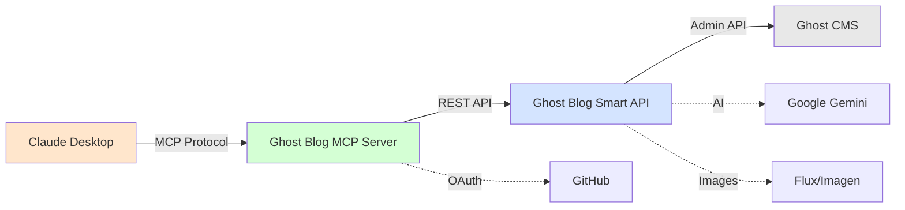

# 🚀 Ghost Blog Management MCP Server

[](https://modelcontextprotocol.io/)
[](https://workers.cloudflare.com/)
[](https://ghost.org/)
[](https://opensource.org/licenses/MIT)

**Transform your Ghost CMS workflow with AI-powered content management directly from Claude Desktop.**

This MCP server brings the full power of Ghost Blog Smart API to Claude, enabling you to create AI-enhanced blog posts, generate stunning feature images, and manage multiple Ghost blogs - all through natural conversation.

## ✨ Why This MCP Server?

### 🎯 **Multi-Blog Management**
Manage unlimited Ghost blogs from a single MCP server. Switch between blogs dynamically by providing credentials, perfect for agencies and content creators managing multiple properties.

### 🤖 **AI-First Content Creation**
- **Smart Create**: Transform rough notes into polished blog posts with Google Gemini
- **Dual Image Generation**: Choose between ultra-fast Flux (3-7s) or professional Imagen (10-15s)
- **Auto Enhancement**: Generate titles, excerpts, and tags automatically
- **Multi-language Support**: Create content in any language

### 📝 **Support for Posts AND Pages**
Create both blog posts and static pages (About, Contact, etc.) with the new `post_type` parameter support.

### 🔐 **Enterprise-Grade Security**
- GitHub OAuth authentication with single-user restriction
- Three-level credential priority system
- HMAC-signed session management
- No hardcoded secrets

## 🏗️ Architecture



## 🛠️ Complete Tool Suite (13 Tools)

| Tool | Description | AI Features |
|------|-------------|-------------|
| `ghost_health_check` | Check API status and health | - |
| `ghost_api_info` | Get API capabilities and version | - |
| **`ghost_create_post`** | Create posts/pages with optional AI images | 🎨 Flux/Imagen |
| **`ghost_smart_create`** | Transform ideas into complete posts | 🤖 Gemini + 🎨 |
| `ghost_get_posts` | List posts with filters | - |
| `ghost_advanced_search` | Search posts by text, tags, dates | - |
| `ghost_get_post_details` | Get complete post information | - |
| `ghost_update_post` | Update post content/metadata | - |
| **`ghost_update_post_image`** | Generate new AI feature image | 🎨 Flux/Imagen |
| `ghost_delete_post` | Delete posts permanently | - |
| `ghost_posts_summary` | Analytics and statistics | - |
| `ghost_batch_get_details` | Efficient batch operations | - |
| `ghost_search_by_date` | Find posts by date patterns | - |

## 🚀 Quick Start

### Prerequisites

1. **Ghost Blog** with Admin API access
2. **Ghost Blog Smart API** deployed ([Instructions](https://github.com/preangelleo/ghost-blog-smart))
3. **Cloudflare account** (free tier works)
4. **GitHub account** for OAuth

### Step 1: Deploy Ghost Blog Smart API

```bash
# Quick start with Docker
docker run -d -p 5000:5000 \
  -e GHOST_ADMIN_API_KEY=your_ghost_key \
  -e GHOST_API_URL=https://your-blog.com \
  -e GEMINI_API_KEY=your_gemini_key \
  -e REPLICATE_API_TOKEN=your_replicate_token \
  --name ghost-blog-api \
  betashow/ghost-blog-smart-api
```

### Step 2: Clone and Configure

```bash
git clone https://github.com/preangelleo/ghost-blog-management-mcp.git
cd ghost-blog-management-mcp
npm install
```

### Step 3: Setup GitHub OAuth

Create a [GitHub OAuth App](https://github.com/settings/developers):

- **Application name**: Ghost Blog Management
- **Homepage URL**: `http://localhost:8792`
- **Callback URL**: `http://localhost:8792/callback`

### Step 4: Configure Environment

```bash
cp .dev.vars.example .dev.vars
```

Edit `.dev.vars`:
```env
GITHUB_CLIENT_ID=your_github_client_id
GITHUB_CLIENT_SECRET=your_github_client_secret
COOKIE_ENCRYPTION_KEY=your_api_key  # Must match Ghost Blog Smart API
```

### Step 5: Update Configuration

Edit `src/tools/ghost-blog-tools.ts`:

```typescript
// Line 4: Your Ghost Blog Smart API URL
const API_BASE_URL = 'http://localhost:5000';  // or your production URL

// Lines 5-7: Your GitHub username for exclusive access
const ALLOWED_USERNAMES = new Set<string>([
  'your-github-username'  // Replace with YOUR username
]);
```

### Step 6: Start Development Server

```bash
npm run dev
# Server runs at http://localhost:8792
```

### Step 7: Configure Claude Desktop

Add to Claude Desktop settings:

```json
{
  "mcpServers": {
    "ghost-blog": {
      "command": "npx",
      "args": ["mcp-remote", "http://localhost:8792/mcp"],
      "env": {}
    }
  }
}
```

## 💡 Advanced Features

### 🎯 Three-Level Credential System

Perfect for managing multiple blogs:

#### Level 1: Dynamic Selection (Highest Priority)
```javascript
// Pass credentials directly in tool parameters
await ghost_create_post({
  title: "My Post",
  content: "Content here",
  ghost_admin_api_key: "blog2_key",  // Override default
  ghost_api_url: "https://blog2.com"  // Override default
})
```

#### Level 2: Worker Configuration
```bash
# Set for entire Worker deployment
wrangler secret put CUSTOM_GHOST_ADMIN_API_KEY
wrangler secret put CUSTOM_GHOST_API_URL
```

#### Level 3: Backend Defaults
Uses Ghost Blog Smart API's configured blog - no additional setup needed.

### 📄 Posts vs Pages Support

```javascript
// Create a blog post (default)
await ghost_create_post({
  title: "Blog Post Title",
  content: "Blog content...",
  post_type: "post"  // Optional, this is default
})

// Create a static page
await ghost_create_post({
  title: "About Us",
  content: "Company information...",
  post_type: "page"  // Creates a page instead of post
})
```

### 🎨 AI Image Generation Options

```javascript
// Ultra-fast generation with Flux (3-7 seconds)
await ghost_create_post({
  title: "My Post",
  content: "Content",
  use_generated_feature_image: true,
  prefer_flux: true
})

// Professional quality with Imagen (10-15 seconds)
await ghost_create_post({
  title: "My Post",
  content: "Content",
  use_generated_feature_image: true,
  prefer_imagen: true
})
```

## 🌟 Usage Examples in Claude

### Create AI-Enhanced Content
```
"Use ghost_smart_create to write a blog post about 'The Future of Remote Work in 2025' with a professional tone"
```

### Manage Multiple Blogs
```
"Get the Animagent blog credentials from my-credentials database, then use ghost_create_post to publish a new announcement there"
```

### Batch Operations
```
"Use ghost_advanced_search to find all posts tagged 'technology', then use ghost_batch_get_details to get their full content"
```

### Update with AI Images
```
"Use ghost_update_post_image on post ID abc123 to generate a new feature image using Imagen"
```

## 🚀 Production Deployment

### Deploy to Cloudflare Workers

```bash
# Login to Cloudflare
wrangler login

# Create KV namespace for OAuth
wrangler kv namespace create "OAUTH_KV"
# Add the namespace_id to wrangler.jsonc

# Deploy to production
npm run deploy

# Set production secrets
wrangler secret put GITHUB_CLIENT_ID
wrangler secret put GITHUB_CLIENT_SECRET
wrangler secret put COOKIE_ENCRYPTION_KEY

# Optional: Set custom Ghost blog (Level 2)
wrangler secret put CUSTOM_GHOST_ADMIN_API_KEY
wrangler secret put CUSTOM_GHOST_API_URL
```

### Update Claude Desktop for Production

```json
{
  "mcpServers": {
    "ghost-blog": {
      "command": "npx",
      "args": ["mcp-remote", "https://your-worker.workers.dev/mcp"],
      "env": {}
    }
  }
}
```

## 📊 Performance Metrics

| Operation | Typical Time | Max Time |
|-----------|-------------|----------|
| Create post (no image) | 2-5s | 10s |
| Create post (with Flux) | 8-15s | 30s |
| Create post (with Imagen) | 15-25s | 45s |
| Smart create (AI content) | 10-20s | 60s |
| Update post | 1-2s | 5s |
| Search/List | <1s | 3s |
| Batch operations | 2-5s | 15s |

*Note: All operations have a 5-minute timeout to ensure reliability*

## 🔒 Security Features

- **GitHub OAuth 2.0**: Industry-standard authentication
- **Single-User Mode**: Restrict access to your GitHub account only
- **Signed Cookies**: HMAC-SHA256 session security
- **Environment Variables**: No hardcoded secrets
- **API Key Protection**: Separate keys for each service
- **Test Mode**: Safe experimentation with `is_test: true`

## 🔍 Troubleshooting

### Common Issues

| Issue | Solution |
|-------|----------|
| "Ghost Blog Smart API not reachable" | Verify Docker container is running: `docker ps` |
| "Unauthorized access" | Update `ALLOWED_USERNAMES` with your GitHub username |
| "API key mismatch" | Ensure `COOKIE_ENCRYPTION_KEY` matches Ghost Blog Smart |
| "Tools not appearing in Claude" | Restart Claude Desktop after configuration |
| "Timeout errors" | API has 5-minute default timeout, check network |

### Debug Commands

```bash
# Check development logs
npm run dev

# Production logs
wrangler tail

# Test Ghost Blog Smart API
curl http://localhost:5000/health

# Test authentication
open http://localhost:8792/authorize
```

## 🤝 Contributing

Contributions are welcome! Please:

1. Fork the repository
2. Create a feature branch (`git checkout -b feature/amazing`)
3. Commit your changes (`git commit -m 'Add amazing feature'`)
4. Push to the branch (`git push origin feature/amazing`)
5. Open a Pull Request

## 📚 Documentation

- [MCP Protocol Documentation](https://modelcontextprotocol.io/)
- [Ghost Blog Smart API](https://github.com/preangelleo/ghost-blog-smart)
- [Ghost Admin API](https://ghost.org/docs/admin-api/)
- [Cloudflare Workers](https://developers.cloudflare.com/workers/)

## 📄 License

MIT License - see [LICENSE](LICENSE) file for details

## 🙏 Acknowledgments

- [Anthropic](https://anthropic.com) for Model Context Protocol
- [Ghost](https://ghost.org/) for the amazing CMS platform
- [Cloudflare](https://cloudflare.com) for Workers infrastructure
- Google for Gemini AI and Imagen
- [Replicate](https://replicate.com) for Flux image generation

## 📞 Support

- **Issues**: [GitHub Issues](https://github.com/preangelleo/ghost-blog-management-mcp/issues)
- **Discussions**: [GitHub Discussions](https://github.com/preangelleo/ghost-blog-management-mcp/discussions)
- **Email**: me@leowang.net

---

<div align="center">

**Built with ❤️ by [leowang.net](https://leowang.net)**

Transform your content creation workflow with AI-powered Ghost CMS management

[Get Started](#-quick-start) • [Documentation](#-documentation) • [Support](#-support)

</div>